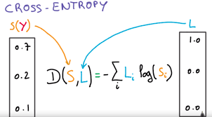
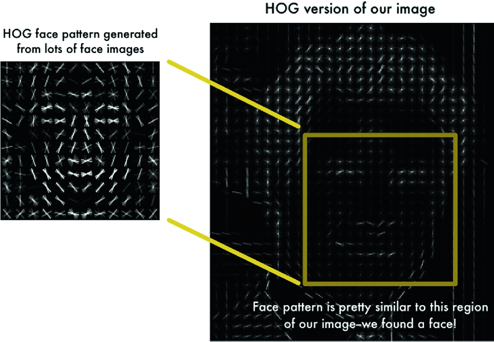
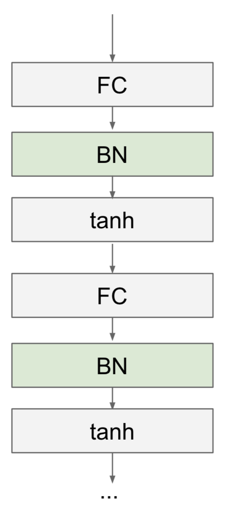
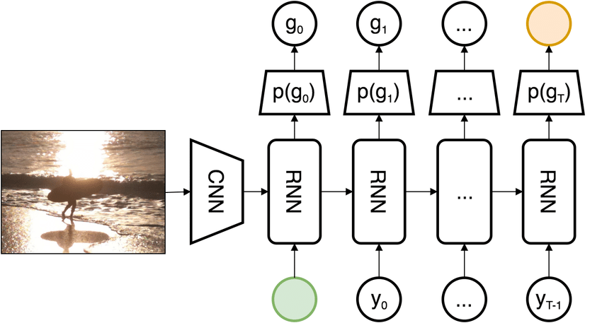
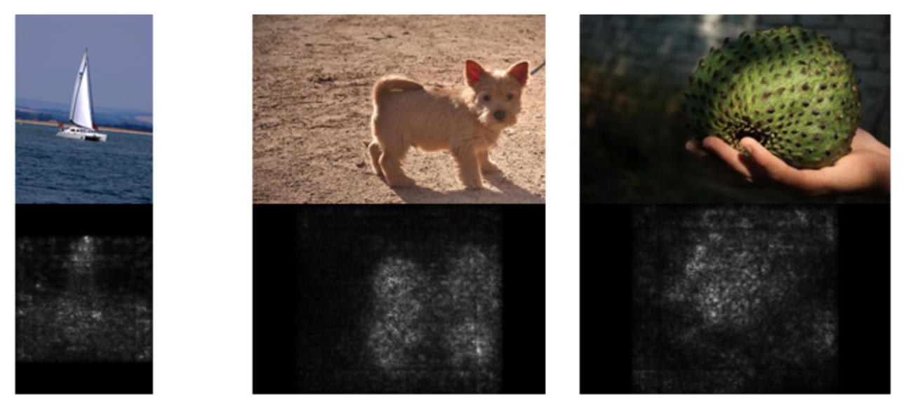
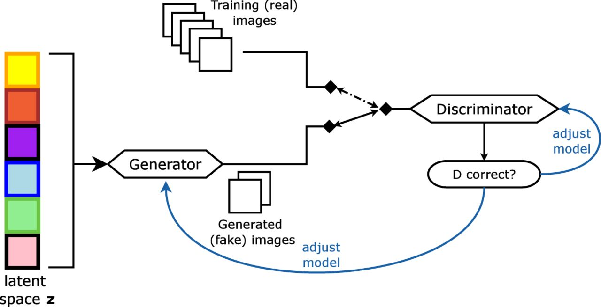

# CS231n Assignments
These are my solutions to the assignments of CS231n offered by the CS Department at Stanford in Spring quarter of 2018. All three assignments have been done on my VM instance of Google Cloud Compute Engine service. The TensorFlow notebooks for assignments 2 and 3 are done on NVIDIA Tesla K80 GPU.

## What is CS231n about?
CS231n (Convolutional Neural Networks for Visual Recognition) is one of the most popular introductory courses on deep learning. Offered every spring since 2015, it is the first intrductory course on deep learning from Dr. Fei-Fei Li's group at Stanford. To give you a better view of the popularity of the course, the first lecture video of CS231n spring 2017 (available [here](https://youtu.be/vT1JzLTH4G4?list=PLC1qU-LWwrF64f4QKQT-Vg5Wr4qEE1Zxk)) has hit an amazing record of 1 million views on YouTube! 
The cornerstone of CS231n is the notion of gaining a deep understanding of the concepts in deep learning, and implementing them from scratch using Numpy and Python. I encourage you to read an article from Andrej Karpathy, the main originator of this course, in Medium about why this deep understanding matters [here](https://medium.com/@karpathy/yes-you-should-understand-backprop-e2f06eab496b). I also highly recommend anyone who is interested in researching the promising field of deep learning to go through the lecture videos, course notes, tutorials, and most importantly, the assignments of CS231n. I am telling you this based on my own experience and the positive feedback of my friends after doing these assignments. I hope that one day every university in the world has a high-quality course about deep learning like CS231n!

## Why going through CS231n assignments?
In my opinion, doing these assignments have two major benefits: 1) You will create everything from scratch by yourself and will learn how to create deep neural networks from simple linear algebraic operations such as dot prodcut and matrix multiplication. This is an entertaining practice, just like when you play with LEGO pieces and construct an intricate design with them! 2) The TAs have designed the pipeline for you and you are assured that the pipeline is efficient. So, what you have to do is to implement the core concepts. However, at the same time, you can learn the efficient pipeline too and use it in your future projects on deep learning.

Here is a breif description of each one of the assignments, the topics they cover, and what you can learn from them:

## Assignment 1. Preliminaries
This assignment is a sort of preculde to working with deep neural networks. The topics of this assignment, such as SVM, K-Nearest Neighbor Model, are mostly covered in machine learning courses. But, implementing them here can give you a better sense of the power of artificial neural networks when you work with them in assignment 2. 
Here is a list of the materials covered in assignment 1:

### 1. KNN
In the first section, you have to train a K-Nearest Neighbor model on a sample of the CIFAR-10 dataset, one of the frequently used dataset for educational purposes. To me, the most exciting part of this section was implementing `*_no_loops` functions, where you should find a way to use vectorized functions of Numpy instead of for loops in Python. 

### 2. SVM
In this section, you have to train a linear SVM model on the CIFAR-10 dataset. In my opinion, the most important part of this section is the implementation of `svm_loss_vectorized`, where you have to implement hinge loss. Once you code it from scratch in Numpy, the differences between this loss and other losses such as cross-entropy will become crystal clear for you, and you will understand how these differences result in different functionalities and capabilities of SVM compared to other classifiers such as feed forward neural netowrks with cross-entropy loss.

### 3. Softmax Classifier
This part can be regarded one of the most important sections of the assignment. You have to implement softmax + cross-entropy loss, which is used in almost all of the deep neural networks nowadays. You have to be careful with the stability of your implementation! It is worth noting that this stability problem has been also considered in deep learning frameworks, where using `log-softmax` is preferred to using `softmax`.
 

### 4. Two-Layer Neural Network
This section is a sort of preclude to assignment 2, where you will work with deep neural networks. But here, you have to train a tiny network with just two layers! Nevertheless, a nice fact about deep learning is that the core ideas used for implementing this tiny neural network will hold for deeper neural networks too! Even for gigantic networks with over 100 layers! 😊

### 5. Image Features
Instead of training your models on raw pixels, in this part, you have to train your models on the HOG and color histogram feature vectors extracted from the CIFAR-10 images. The good news is that you don't have to implement the feature extraction procedure as its code is given to you. The models are also same as previous sections and just the inputs have changed.

## Assignment 2. Neural Networks
This assignment might be the most important assignment of the course which covers the key ideas in training deep neural networks. In this assignment, you will work with various concepts in deep learning, including different networks, important layers, activation functions, optimization algorithms, regularization techniques, and etc, with both Numpy and deep learning frameworks, such as PyTorch and TensorFlow. 
Here is a brief description of the different sections of assignment 2:

### 1. Fully Connected Networks
Learning how Fully connected Netowrks (FCN) work is the entry point to deep learning. You will find the implementation of the forward pass of fully connected layers pretty straightforward. But, deriving the backpropagation for these layers is super imortant and tricky. Neverthelss, it is also one line of code and this is the beauty of deep learning! Simple and short implementations lead to powerful methods that can solve challenging problems. 
In addition to fully connected networks, you will also learn how the different optimization algorithms such as SGD, SGD+Momentum, RMSProp, and Adam work. You will also get familiar with some valuable practical tips for training neural networks --which is particularly useful for your future research in this field--, such as overfitting on a small training set and hyperparameter tuning. 

### 2. Batch Normalization
Implementing Batch normalization (BN) is tricky, mostly beacause deriving the formula for its backpropagation does not seem straightforward at first glance. However, after deriving the formula, you will see that it can be implemented in 3 or 4 lines of code! You will also learn that batch normalization is sensitive to batch size and some variants of it such as layer normalization have fixed this problem. BN was propsed in 2015 by researchers at Google and is an extremely important component in very deep neural networks, such as ResNets, as it helps remove the gradient vanishing and exploding problems.

### 3. Dropout
Dropout is a method that helps neural networks overfit less to the training set and gives some sort of ensemble properties to neural networks. Although it is not backed by a strong theoretical foundation, experimentally, it has helped the models to converge to the local minima faster. Dropout is used in many useful models such as RNN language models and LSTM translators.

### 4. Convolutional Neural Networks
Now you have reached the super important section of all of the assignments. CNNs are probably the focus of CS231n (the name of the course have been adopted from them!). If you are not careful in implementing the convolutional layers, you will end up with lots of for loops which makes its prohibitively slow! This part shows that how proficient you have become in working with Numpy through doing the previous sections of assigments 2 and 1. 
One nice thing about the CNN IPynotebook in assignment 2 is that as your Numpy implementation of convoutional layers is not parallelizable on GPUs, training a CNN with more than four or five layers will be prohibitively slow; however, the TAs have provided a faster implementation of layers in Cython called `fast_layers`. Thus, you still have the opportunity to create the networks from scratch by yourself with fast layers. There are also additional IPynotbooks which walk you through implementation of all of the networks in deep learning frameworks.

## Assignment 3. RNNs, Visualizations, and Generative Models
In the last assignment, there are lots of stuff that you have to implement; from vanilla RNNs and LSTMs and using them in the task of image captioning, to implementing GANs as the current state-of-the-art generative models in computer vision. You will get familiar with saliency maps and class visualizations as two important interpretation methods for CNNs, and get to know adversarial attacks on CNNs.

### 1. Image Captioning
In this section, at first, you have to implement RNN and LSTM cells with their forward and backward propagation in Numpy. Then, you have to construct recurrent networks with these cells and use their networks in the task of image captioning on the Microsoft COCO dataset. Be careful to learn this part as well as you can, as training and testing recurrent networks have some slight differences with training and testing other models, including MLPs and CNNs.

### 2. Visualization
Saliency maps and class visualization are two simple and important techniques used for interpreting how properly a CNN functions. These methods are quite old and were first proposed in the paper "Deep inside convolutional networks: Visualising image classification models and saliency maps" in 2013 by Andrew Zisserman's group at Oxford.

### 3. Style Transfer
This is one of the most exciting parts of the assignments of the course. You will learn how to combine the style of some of the famous paintings in the world with real photos and create beautiful images! You can see some more breathtakingly beautiful images [here](https://deepdreamgenerator.com/) as a part of Deep Dream project! 

### 4. Generative Adversarial Network (GAN)
Yann LeCun, the Turing award winner in 2018 and the father of convolutional neural netowrks, has once said: "The most important one, in my opinion, is adversarial training (also called GAN for Generative Adversarial Networks). This is an idea that was originally proposed by Ian Goodfellow when he was a student with Yoshua Bengio at the University of Montreal (he since moved to Google Brain and recently to OpenAI). This, and the variations that are now being proposed is the most interesting idea in the last 10 years in ML, in my opinion."  
GANs is perhaps one of the most frequently used network in deep learning and computer vision. The idea behind GANs is unique and the aulity of the generated images . In the recent years lots of variants of GAN has been proposed and it is still one of the most active areas of research. The paper of GAN, "Generative adversarial nets", is one of the most cited papers in the field of deep learning. 

